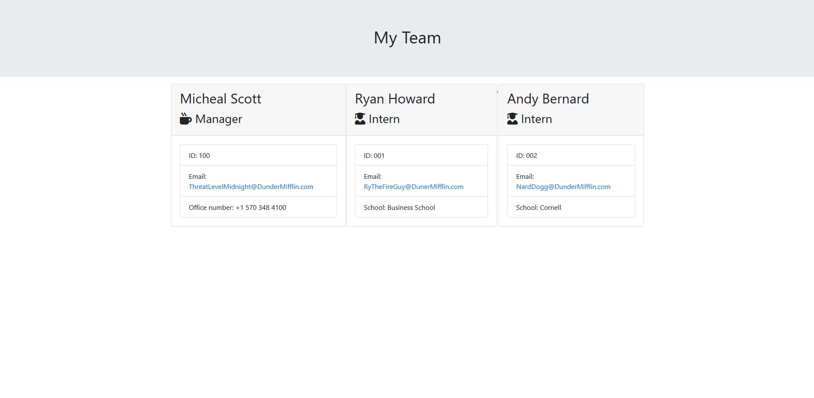

# team-profile-generator 👧👧👨👴
>Developing a usable team list by CLI.

## 💻What I used💽
JavaScript, NodeJS, Jest

## Update Note (Mar 4, 2020)
- Added initial files

## Update Note (Mar 7, 2020)
- Developed Employee classes
- Developed Employee functions

## Update Note (Mar 8, 2020)
- Added unique inquiries for each time of employee

## Update Note (Mar 10, 2020)
- Added JS to generate an HTML based of of user input

## Testing
- All testing was done with Jest

## I love getting feedback and support! 🎆🎇🎈

## ☁🌡⚡🌩 Preview

## Author

**🏍Dru Sanchez🏍**

*Twitter: [ImNotDrumatic](https://twitter.com/ImNotDrumatic)
*Github:  [DruSanchez](https://github.com/Drubaloo)
